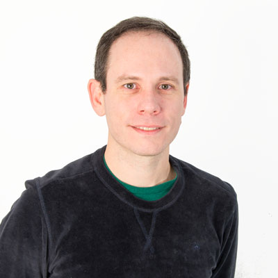

***
# ¿Quiénes somos?

---
## Leandro Di Tommaso

  

<ul>
<li>Fundador de Mikroways en 2004</li>
<li>Docente en UNLP</li>
<li>Trabajo en administración de redes y servidores desde 2007</li>
<li>Con DevOps desde 2013, Docker 2014</li>
</ul>

---
## Christian Rodriguez

  

<ul>
<li>Docente en UNLP</li>
<li>Miembro del equipo de soporte CeSPI-UNLP hasta 2006</li>
<li>Instructor CCNA/RedHat/Solaris/IRIX </li>
<li>Coordinador del equipo de desarrollo de software interno (UNLP)
perteneciente a CeSPI </li>
<li>Aplicando DevOps desde 2012 </li>
<li>Coordino el área de IT para los desarrollos propios</li>
</ul>

---
## ¿Qué hacemos en nuestro trabajo?

* Desde fines de 2013, nos consolidamos como equipo de IT para el área de
  desarrollo.
* Aplicando DevOps gestionamos:
  * 58 VMs virtualizando con Proxmox y VMWare.
  * Ambientes automatizados con [chef](https://www.chef.io/).
      * 67 aplicaciones en ambiente de producción.
      * 55 aplicaciones en ambiente de pruebas.
  * Monitoreo y backups contemplados en la automatización.
  * Ambientes idénticos en desarrollo y producción: basados en [vagrant](https://www.vagrantup.com/) y [chef](https://www.chef.io/).

---
## ¿Qué hacemos en nuestro trabajo?

* En 2016 establecimos [Mikroways](http://www.mikroways.net) como una sociedad.
  * Trabajamos con DevOps (Chef y Docker).
  * Monitoreo inteligente (Estadísticas y logs).
  * Consultoría.
  * Capacitaciones.
  * Cloud computing.
  * Desarrollo de software.
  * IoT.
* Partners de Chef, Docker, Rancher y Amazon.
***
