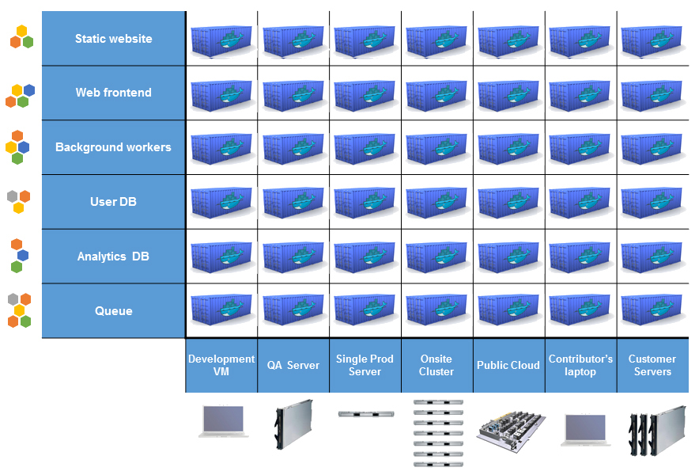
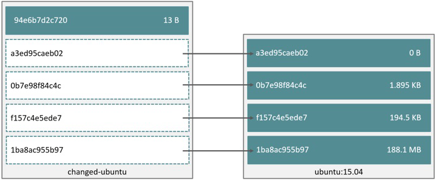

***
# Docker
## Introducción

---
## Antecedentes

* Antiguamente, transportar bienes tenía muchos problemas.
  * Diferentes tamaños, formas, resistencias, etc.
  * Capacidad de transporte reducida.
  * Difícil realizar un seguimiento.
  * Pérdida parcial de mercadería.
  * Grandes costos.

---
## Contenedores

* Los contenedores solucionaron muchos problemas:
  * Un vendedor pone todos sus productos en un contenedor y sólo debe
    preocuparse por ese contenedor.
  * Los productos nunca se manipulan individualmente.
  * Tamaños y formas estandarizadas, simplifica toda la cadena de transporte: el
    transporte sólo debe llevar contenedores.

---
## Contenedores


---
## ¿Qué es docker?

* Contenedores de software.
  * Empaqueta aplicaciones en una unidad estándar de intercambio.
* Única pieza de software en un filesystem completo que contiene **todo lo
  necesario** para ejecutar una aplicación: código, librerías, herramientas,
  etc.
* Garantiza que el software **siempre correrá de igual forma** sin importar su
  ambiente.

---
## ¿Por qué Docker?

* Diferencias entre el ambiente de desarrollo, testing y producción.
* Instalación de una aplicación en diferentes plataformas.
* Deploy de aplicaciones complejas.
* Ejecución de código antiguo.

---
## Matriz del infierno


---
## Matriz del infierno



---
## Comparación con máquinas virtuales

<table>
<tr><td>

</td><td>

</td></tr>
</table>

---
## Características de Docker

* Los contenedores Docker son:
  * **Livianos**: menos overhead para su ejecución.
  * **Abiertos**: basados en estándares abiertos.
  * **Seguros**: aislan las aplicaciones entre sí y de la infraestructura donde corren.


---
## Historia

* Emerge como proyecto de SL en 2013.
* Virtualización a nivel de sistema operativo.
* Se basa en el uso de:
  * [Cgroups](https://en.wikipedia.org/wiki/Cgroups) para restringir recursos
    como cpu, memoria, IO, red, etc.
  * [Kernel namespaces](https://en.wikipedia.org/wiki/Linux_namespaces) permite
    aislar y virtualizar recursos de una colección de procesos como por ejemplo:
    PID, hostname, UID, acceso a la red, comunicación entre procesos,
    filesystem, etc.
  * [Filesystem de unión](https://docs.docker.com/engine/userguide/storagedriver/selectadriver/)
    como es el caso de AUFS, OverlayFS, Btrfs, Device Mapper, ZFS, etc.

---
## Historia

* Con las características antes mencionadas se obtienen contenedores
  independientes en una instancia Linux que evita el overhead de manipular VMs.
* Antes de la versión 0.9, Docker usaba LXC como base. A partir de la 0.9
  incorporaron libcontainer, eliminando la dependencia de LXC dado que accede
  directamente al kernel para manipular cgroups, namespaces, apparmor, interfaces
  de red, etc.


---
## Imágenes y contenedores

* Imagen:
  * Filesystem y parámetros para utilizarla.
  * No cambia nunca y no tiene estados.
* Contenedor:
  * Instancia de una imagen (resultado de ejecutarla).
  * Tiene una capa de RW volátil.

---
## Imágenes y contenedores


---
## Imágenes y contenedores


---
## Imágenes y contenedores


---
## Imágenes y contenedores



---
## Instalación de Docker

* Docker puede instalarse en:
  * Linux.
  * MacOS.
  * Windows.

---
## Instalación de Docker en Linux

* Requisitos:
  * Sistema de 64 bits.
  * Kernel 3.10 o superior.
* Existen binarios para la mayoría de las distribuciones.

---
## Instalación de Docker en Windows/MacOS

* Usando Docker Toolbox.
  * Utiliza Docker Machine (no nativo).
  * Windows 7/MacOS 10.8 o superior
* Docker for (Windows/Mac):
  * Corre una aplicación nativa usando (Hyper-V/xhyve para virtualizar la Docker
    Engine).
  * Windows 10/MacOS 10.10.3 o superior.

---
## Comandos básicos

```bash
docker run
docker ps
docker commit
docker images
docker build
docker pull
docker push
docker tag
docker inspect
docker volume
```

---
## Nuestro primer contenedor

```bash
$ docker run -it ubuntu:16.04 /bin/bash
  Unable to find image 'ubuntu:16.04' locally
  16.04: Pulling from library/ubuntu
  
  6bbedd9b76a4: Pull complete
  fc19d60a83f1: Pull complete
  de413bb911fd: Pull complete
  2879a7ad3144: Pull complete
  668604fde02e: Pull complete
  Digest: sha256:2d44ae143feeb36f4c898d32ed2ab2dffeb3a573d2d8928646dfc9cb7deb1315
  Status: Downloaded newer image for ubuntu:16.04
  
  root@99a3403db59a:/# cat /etc/issue
  Ubuntu 16.04.1 LTS \n \l
```

---
## Dockerfile

* Archivo de texto plano para crear imágenes de Docker.
* Permite escribir instrucciones a ejecutar.
* Automatiza el proceso de la creación de imágenes.
* Permite repetir y modificar fácilmente una imagen.
* Generar de forma simple imágenes derivadas.

---
## Dockerfile

```bash
FROM ubuntu:16.04
MAINTAINER Leandro Di Tommaso

# Instalar Nginx y configurar una página personalizada
RUN apt-get update && apt-get install -y nginx
RUN mkdir /var/www/html/ejemplo
RUN echo "<html><h1>Nginx en Docker</h1></html>" > /var/www/html/ejemplo/index.html

EXPOSE 80
CMD    ["nginx", "-g", "daemon off;"]
```

---
## Nuestra primer imagen

```bash
$ docker build -t leoditommaso/nginx:1.0.0 .
  Sending build context to Docker daemon 2.048 kB
  Step 1 : FROM ubuntu:16.04
  16.04: Pulling from library/ubuntu
  6bbedd9b76a4: Already exists
  fc19d60a83f1: Already exists
  de413bb911fd: Already exists
  2879a7ad3144: Already exists
  668604fde02e: Already exists
  Digest: sha256:2d44ae143feeb36f4c898d32ed2ab2dffeb3a573d2d8928646dfc9cb7deb1315
  Status: Downloaded newer image for ubuntu:16.04
   ---> f753707788c5
  Step 2 : MAINTAINER Leandro Di Tommaso
   ---> Running in f93e6923c21e
   ---> a1144bb80b28
  Removing intermediate container f93e6923c21e
  Step 3 : RUN apt-get update && apt-get install -y nginx
   ---> Running in 489697f5e5d5
  Get:1 http://archive.ubuntu.com/ubuntu xenial InRelease [247 kB]

  ... (SALIDA REMOVIDA)

  Processing triggers for systemd (229-4ubuntu10) ...
   ---> 136943551ea1
  Removing intermediate container 489697f5e5d5
  Step 4 : RUN mkdir /var/www/html/ejemplo
   ---> Running in 443cfc08af15
   ---> aff42d6aa899
  Removing intermediate container 443cfc08af15
  Step 5 : RUN echo "<html><h1>Nginx en Docker</h1></html>" >
  /var/www/html/ejemplo/index.html
   ---> Running in 2bea67c34185
   ---> 4c9ad433769b
  Removing intermediate container 2bea67c34185
  Step 6 : EXPOSE 80
   ---> Running in c3bc2fd14bff
   ---> df1abe4570d5
  Removing intermediate container c3bc2fd14bff
  Step 7 : CMD nginx -g daemon off;
   ---> Running in 9d39a9f69468
   ---> 8fd110f3364a
  Removing intermediate container 9d39a9f69468
  Successfully built 8fd110f3364a

$ docker images
  REPOSITORY          TAG    IMAGE ID       CREATED          SIZE
  leoditommaso/nginx  1.0.0  8fd110f3364a   2 minutes ago    223.2 MB
  ubuntu              16.04  f753707788c5   4 weeks ago      127.2 MB
```

---
## Nuestra primer imagen

```bash
$ docker run -d -p 80:80 leoditommaso/nginx:1.0.0
```


---
## Reusando capas

```bash
$ docker build -t leoditommaso/nginx:1.1.0 .
  Sending build context to Docker daemon 2.048 kB
  Step 1 : FROM ubuntu:16.04
   ---> f753707788c5
  Step 2 : MAINTAINER Leandro Di Tommaso
   ---> Using cache
   ---> a1144bb80b28
  Step 3 : RUN apt-get update && apt-get install -y nginx
   ---> Using cache
   ---> 136943551ea1
  Step 4 : RUN mkdir /var/www/html/ejemplo
   ---> Using cache
   ---> aff42d6aa899
  Step 5 : RUN echo "<html><h1>Nginx en Docker</h1></html>" >
  /var/www/html/ejemplo/index.html
   ---> Using cache
   ---> 4c9ad433769b
  Step 6 : EXPOSE 80
   ---> Using cache
   ---> df1abe4570d5
  Step 7 : CMD nginx -g daemon off;
   ---> Using cache
   ---> 8fd110f3364a
  Successfully built 8fd110f3364a

$ docker images
  REPOSITORY          TAG    IMAGE ID       CREATED          SIZE
  leoditommaso/nginx  1.0.0  8fd110f3364a   4 minutes ago    223.2 MB
  leoditommaso/nginx  1.1.0  8fd110f3364a   4 minutes ago    223.2 MB
  ubuntu              16.04  f753707788c5   4 weeks ago      127.2 MB
```

---
## Historia de la imagen

```
$ docker history 8fd110f3364a
  IMAGE          CREATED         CREATED BY                                      SIZE
  8fd110f3364a   9 minutes ago   /bin/sh -c #(nop)  CMD ["nginx" "-g" "daemon    0 B
  df1abe4570d5   9 minutes ago   /bin/sh -c #(nop)  EXPOSE 80/tcp                0 B
  4c9ad433769b   9 minutes ago   /bin/sh -c echo "<html><h1>Nginx en Docker</h   38 B
  aff42d6aa899   9 minutes ago   /bin/sh -c mkdir /var/www/html/ejemplo          0 B
  136943551ea1   9 minutes ago   /bin/sh -c apt-get update && apt-get install    96.07 MB
  a1144bb80b28   11 minutes ago  /bin/sh -c #(nop)  MAINTAINER Leandro Di Tomm   0 B
  f753707788c5   4 weeks ago     /bin/sh -c #(nop)  CMD ["/bin/bash"]            0 B
  <missing>      4 weeks ago     /bin/sh -c mkdir -p /run/systemd && echo 'doc   7 B
  <missing>      4 weeks ago     /bin/sh -c sed -i 's/^#\s*\(deb.*universe\)$/   1.895 kB
  <missing>      4 weeks ago     /bin/sh -c rm -rf /var/lib/apt/lists/*          0 B
  <missing>      4 weeks ago     /bin/sh -c set -xe   && echo '#!/bin/sh' > /u   745 B
  <missing>      4 weeks ago     /bin/sh -c #(nop) ADD file:b1cd0e54ba28cb1d6d   127.2 MB
```

---
## Reusando imágenes

```bash
$ docker run -d -p 80:80 nginx
  da48ee78d747bb591ce19aba0067ef08cbfc61cc15edc22c54e06293cea0d067

$ docker ps
  CONTAINER ID   IMAGE   COMMAND                  CREATED         STATUS          PORTS                         NAMES
  da48ee78d747   nginx   "nginx -g 'daemon off"   53 seconds ago  Up 52 seconds   0.0.0.0:80->80/tcp, 443/tcp   sick_gates
```


---
## Rehaciendo nuestra imagen

```bash
FROM nginx
MAINTAINER Leandro Di Tommaso

# Configurar una página personalizada
RUN mkdir /usr/share/nginx/html/ejemplo
RUN echo "<html><h1>Nginx en Docker</h1></html>" > /usr/share/nginx/html/ejemplo/index.html
```

---
## Rehaciendo nuestra imagen

```bash
$ docker build -t leoditommaso/nginx:1.2.0 .
  Sending build context to Docker daemon 2.048 kB
  Step 1 : FROM nginx
   ---> 4a88d06e26f4
  Step 2 : MAINTAINER Leandro Di Tommaso
   ---> Running in a26b83fa5203
   ---> 262f7d703c38
  Removing intermediate container a26b83fa5203
  Step 3 : RUN mkdir /usr/share/nginx/html/ejemplo
   ---> Running in 4be7d2590452
   ---> 810b82a8e071
  Removing intermediate container 4be7d2590452
  Step 4 : RUN echo "<html><h1>Nginx en Docker</h1></html>" >
  /usr/share/nginx/html/ejemplo/index.html
   ---> Running in ac766cd14d5b
   ---> e63d722c67f2
  Removing intermediate container ac766cd14d5b
  Successfully built e63d722c67f2
```

---
## Rehaciendo nuestra imagen

```bash
$ docker run -d -p 80:80 leoditommaso/nginx:1.2.0
  266399f252a7ef71e4821b375f0edc1777e7dec2f907bb0434c46c629fd3926d

$ docker ps
CONTAINER ID    IMAGE                      COMMAND                 CREATED        STATUS        PORTS                         NAMES
266399f252a7    leoditommaso/nginx:1.2.0   "nginx -g 'daemon off"  3 seconds ago  Up 3 seconds  0.0.0.0:80->80/tcp, 443/tcp   peaceful_euler
```


---
## La registry

* Servicio para almacenar y distribuir imágenes de Docker.
* Open source (Licencia Apache).
* Instalación privada
  * Acceso local para mayor velocidad de descarga.
  * Imágenes en un ambiente controlado y gestionado por la organización.
* Servicio en la nube (Docker Hub).
  * Libre de mantenimiento.

---
## Registry privada

Para levantar la registry podemos usar Docker y subir nuestras propias imágenes.

```bash
docker run -d -p 5000:5000 --name registry registry:2
docker pull ubuntu
docker tag ubuntu localhost:5000/myfirstimage
docker push localhost:5000/myfirstimage
docker pull localhost:5000/myfirstimage
```

---
## Docker Hub

* Gratis para imágenes públicas.
* Soporta builds automáticos (desde Github/Bitbucket).
* Cuentas para organizaciones.
* Plan pago para imágenes privadas.
* https://hub.docker.com
***
