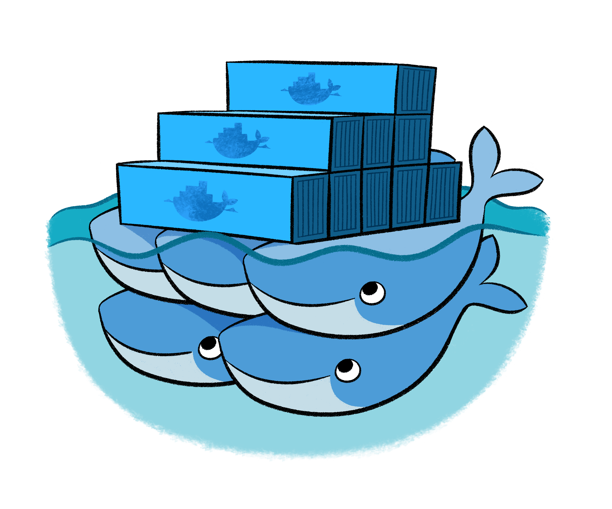
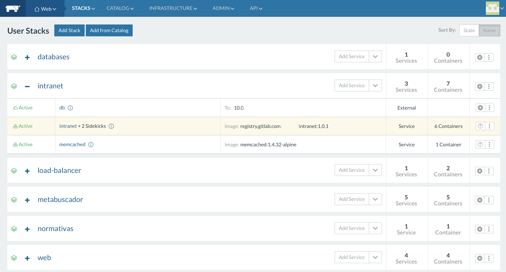

***
# Docker en producción

---
## Los distintos esquemas

* Usando Docker para iniciar servicios de forma aislada.
* Usando un cluster de docker.

---
## Docker standalone

* Cada servidor Linux corre el servicio de Docker en forma aislada.
* Los contenedores pueden iniciarse automáticamente durante el booteo usando:
  * Manejadores de procesos como [upstart](http://upstart.ubuntu.com/),
    [systemd](https://freedesktop.org/wiki/Software/systemd/) o [supervisor](http://supervisord.org/).
  * A través de políticas de reinicio (Docker >= 1.2).

---
## A través de manejadores de procesos

Dado que Docker no setea políticas de reinicio por defecto, cuando un servicio
iniciado con Docker termina, no se toma ninguna acción. 

<small>
Las políticas de reinicio podrían conflictuar con los manejadores de procesos.
</small>

### Integración con los manejadores de procesos

* Cuando un contenedor ya corre como esperamos, entonces podemos attacharlo a un
  manejador de procesos para que él lo maneje.
* Corriendo  `docker start -a` Docker attachará al contenedor corriendo (o
  iniciará si no está corriendo) reenviando las señales al manejador de
  procesos.

---
## Ejemplos

Para entender los siguientes ejemplos veremos qué hace:

`docker start -a`

```bash
# Iniciamos un contenedor nginx daemonizado y nombrado:
docker run -d  --name=nginx_docker -p 9090:80 nginx

# El contenedor ya atiende en el puerto 9090:
curl http://localhost:9090

# Usando docker start para attachar al contenedor nombrado
docker start -a nginx_docker
Ctrl+C # envía la señal SIGTERM al proceso. Muere el contenedor
       # el comando curl ya no es exitoso

# Usando nuevamente docker start
docker start -a nginx_docker # reinicia el servicio
```
---
## Ejemplo upstart

Un contenedor que inicia Redis.

```bash
description "Redis container"
author "Me"
start on filesystem and started docker
stop on runlevel [!2345]
respawn
script
  /usr/bin/docker start -a redis_server
end script
```

---
## Ejemplo systemd

```bash
[Unit]
Description=Redis container
Requires=docker.service
After=docker.service

[Service]
Restart=always
ExecStart=/usr/bin/docker start -a redis_server
ExecStop=/usr/bin/docker stop -t 2 redis_server

[Install]
WantedBy=default.target
```

<small>
`docker stop -t TIME` envía la señal `SIGTERM` y luego del tiempo especificado envía
`SIGKILL`
</small>

---
## Políticas de reinicio

Si no queremos utilizar manejadores de procesos, entonces podemos emplear las
políticas de reinicio.

Estas políticas permiten especificar cómo un contenedor debería o no ser
reiniciado cuando termina.

---
## Políticas de reinicio

* **no**: no iniciar el contenedor cuando termina. *Valor por defecto*.
* **on-failure:[max]**: reiniciar solo si el contenedor termina con exit
  status diferente a cero. Limitar opcionalmente los reintentos de reinicio.
* **always**: siempre reiniciar el contenedor. Además el contenedor se iniciará
  cuando inicia el daemon Docker.
* **unless-stopped**: idem anterior, salvo que en un reinicio del servicio
  Docker considera si previamente fue detenido.

---
## Ejemplo de política de reinicio

```bash
# Iniciamos ninx con restart policy always
docker run -d --restart=always --name=nginx_docker -p 9090:80 nginx

# Verificamos la cantidad de reinicios:
docker inspect  -f "{{ .RestartCount }}" nginx_docker

# Matamos abruptamente el contenedor
docker exec nginx_docker kill -QUIT 1 

# Verificamos la cantidad de reinicios:
docker inspect  -f "{{ .RestartCount }}" nginx_docker

```
<small>
nginx recibe la señal QUIT para finalizar el proceso
https://www.nginx.com/resources/wiki/start/topics/tutorials/commandline/
</small>

---
## Clusters docker

* La idea detrás de los clusters Docker es la de disponer de nodos Linux con el
  Docker Engine de tal forma de poder utilizarlos para correr contenedores.
  * Estos Linux deben ser muy pequeños dado que su única razón de ser es la de
    proveer un kernel, no utilidades.
* Serían como equipos físicos pertenecientes a un pool de hardware disponible en
  un virtualizador como XEN o VMWare.

---
### Los clusters más conocidos

<table class="product_logos" >

<tr>
<td>  </td>
<td><a href="https://docs.docker.com/engine/swarm/">Swarm </a></td>
</tr>

<tr>
<td>  </td>
<td> <a href="http://rancher.com/">Rancher</a> </td>
</tr>

<tr>
<td>  </td>
<td> <a href="http://kubernetes.io/">Kubernetes</a> </td>
</tr>

<tr>
<td>  </td>
<td> <a href="http://mesos.apache.org/">Apache Mesos</a> </td>
</tr>

</table>

---
## Características de todos los clusters

* Diseño descentralizado.
* Servicios, pods o stacks en vez de contenedores.
* Posibilidad de escalar.
* Conciliación para alcanzar el estado deseado.
* Service discovery.
* Load balancing.
* Actualizaciones en caliente.

---
## Consideraciones

* El scheduler es el encargado de determinar donde se inicia cada contenedor.
* Asociado al scheduler trabajan los health checks que garantizan la
  conciliación de un estado deseado: que hayan N contenedores para el servicio
  X.
* La distribución mágica del scheduler complica el manejo de volúmenes.
  * Los volúmenes pertenecen a un nodo.
  * Si el nodo cambia, se pierden los datos.

---
## Volúmenes distribuidos

* Necesidad de compartir datos entre los nodos del cluster.
* Aparecen diferentes implementaciones de volúmenes compartidos. Las más
  populares son:
  * [Convoy](https://github.com/rancher/convoy)
      * _Hoy Rancher promueve rancher-nfs_
  * [Flocker](https://clusterhq.com/flocker/introduction/)

---
## Ejemplo Rancher


***
